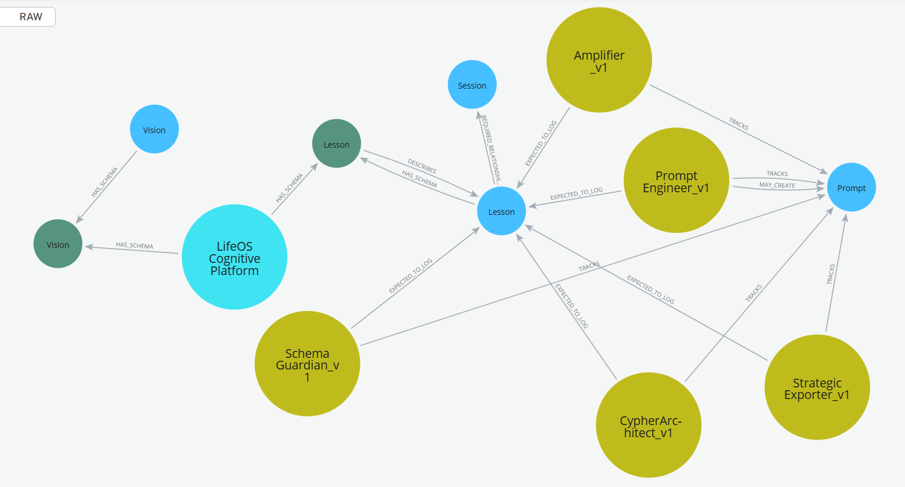

# LifeOS: A Cognitive Graph for Auditable AI

## 🧠 What You're Looking At

This is a real snapshot from the LifeOS cognitive graph platform — a self-documenting system that tracks AI agents, prompt engineering, schema evolution, and knowledge lessons using Neo4j.

At the core: a structured protocol ensures that every AI agent (e.g., `CypherArchitect_v1`, `SchemaGuardian_v1`, etc.) must log its reasoning and decision history into `Lesson` nodes — forming a **glass-box memory system** that enables:

- Transparent AI workflows
- Schema-aware orchestration
- Explainable prompts
- Agent-based architecture with built-in accountability

## ⚙️ Why It Matters

Too many LLM-based systems are:

- Unstructured
- Hallucination-prone
- Impossible to audit
- Costly due to inefficient token usage

LifeOS addresses these by **anchoring agent behavior and schema design directly in the graph.** Agents don’t just use the graph — they evolve it, under constraint, with full traceability.

## 🚀 Built With

- Neo4j (AuraDB & self-hosted instances)
- Python orchestration layer
- OpenAI, Gemini, Anthropic, Mistral LLM agents
- NeoDash dashboards

## 💡 Inspired By

- Semantic RAG
- Multi-agent planning
- Git-style prompt versioning
- Production-grade graph governance

---

If you're building the next wave of AI+KG systems, or facing the friction of messy LLM integration — let's connect.
